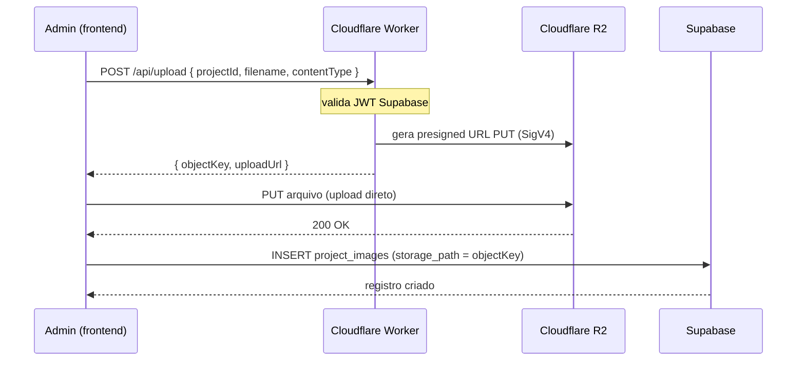

# Arquitetura de Armazenamento de Imagens

> **Status:** em migração do Supabase Storage → Cloudflare R2
> **Última atualização:** 2026-08-24

## Visão geral

O projeto mantém o **Supabase** para banco de dados (PostgreSQL), autenticação
do módulo admin e metadata dos projetos/imagens. O **armazenamento e a entrega
das imagens** passam a ser feitos pelo **Cloudflare R2**, eliminando o egress
e os limites de storage do plano gratuito do Supabase.

```
React/Vite
    │
    ├── Supabase
    │      ├── PostgreSQL (projects, project_images)
    │      └── Authentication (Admin admin)
    │
    ├── Cloudflare Worker (capa segura)
    │      ├── POST /api/upload   → presigned URL (valida JWT)
    │      └── DELETE /api/delete → remove objeto (valida JWT)
    │
    └── Cloudflare R2 (bucket público)
           └── projects/{projectId}/original/{uuid}.{ext}
           └── heroes/*
```

## Responsabilidades

| Componente | Responsável por |
|---|---|
| Supabase PostgreSQL | `projects`, `project_images` (metadata), RLS |
| Supabase Auth | Sessão de usuários administrativos |
| Cloudflare Worker | Validação de sessão + geração de presigned URLs (upload/delete) |
| Cloudflare R2 | Armazenamento e entrega dos binários das imagens |

## Camada de abstração de URLs

Todo acesso a URLs de imagem passa por um único módulo:

- `src/lib/r2/config.ts` → define `VITE_R2_PUBLIC_URL` e a função `getImageUrl(objectKey)`
- `src/lib/r2/index.ts` → serviço de upload/delete via Worker + re-export de `getImageUrl`

Os componentes do frontend **nunca** montam URLs do R2 manualmente. Eles usam
`getImageUrl()` (ou as helpers de `src/utils/imageUrl.ts`: `optimizedSrc`,
`buildSrcSet`, etc.). Isso permite trocar de provedor (R2 → outro CDN) sem
alterar dezenas de componentes.

## Fluxo de upload (Admin)



> Se o upload ao R2 falhar ao NÃO criar o registro no banco (sem órfãos).
> O registro só é criado após o upload confirmado.

## Fluxo de delete

```
Admin → DELETE /api/delete { objectKey } (JWT)
  → Worker valida sessão e remove objeto do R2
  → Supabase remove o registro em project_images
```

## Fluxo de leitura (público)

```
React → getImageUrl(objectKey) → https://images.brunacamara-arq.com.br/<objectKey>
```

## Bucket e convenção de objetos

- Bucket: público (ex.: `arch20-portfolio-images`)
- Estrutura:
  - `projects/{projectId}/original/{uuid}.{ext}` — imagens dos projetos
  - `heroes/*` — imagens de página hero

> O banco armazena apenas a `storage_path` (object key relativa), nunca a URL
> completa. Isso mantém o schema independente do provedor.